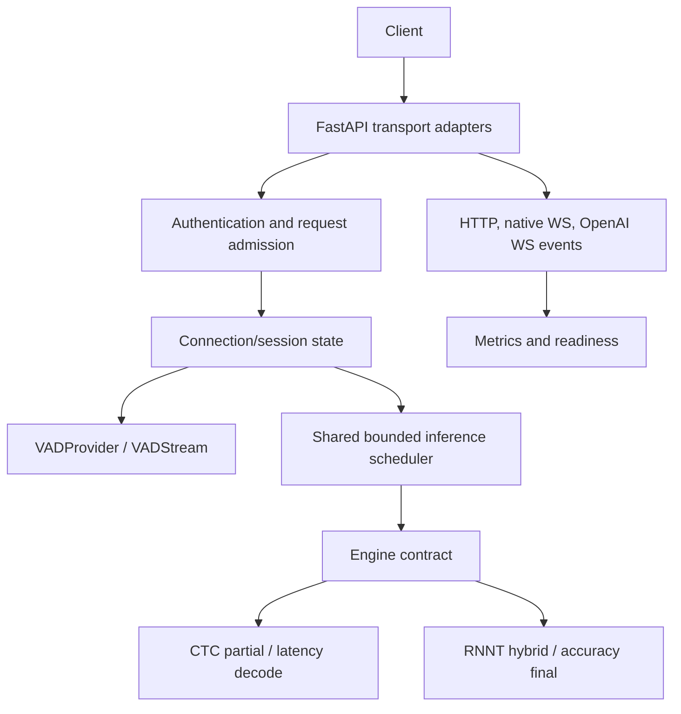

# Architecture, Research, and Operations Record

This document is the durable engineering record for the IndicConformer realtime ASR
service. It explains ownership, protocol flow, scheduler/VAD invariants, the
race-condition hardening work, the research that informed optimization decisions,
and the safe deployment/verification procedure.

Use this document with `AGENTS.md` and `README.md`:

- `AGENTS.md` is the binding change and release policy.
- `README.md` is the user-facing API and setup guide.
- This file is the implementation map and research ledger.

No credentials, model weights, audio, transcripts, host-only paths, or ephemeral
image tags belong in this document.

## System map



The service is one ASR process owning one engine, one scheduler, and one
process-owned VAD provider. Every inference surface enters the same bounded
admission path. Model inference never runs on the asyncio event loop.

## Public protocol surfaces

| Surface | Transport | Audio contract | Decoder policy |
| --- | --- | --- | --- |
| `/v1/audio/transcriptions` | OpenAI-compatible REST | Multipart audio decoded to mono 16 kHz | RNNT final |
| `/v1/models` | OpenAI-compatible REST | None | None |
| `/v1/realtime` | OpenAI-compatible JSON WS | Base64 PCM16LE mono 24 kHz, exact 20 ms transport framing | CTC partials, RNNT finals |
| `/v1/transcribe` | Native REST | Mono 16 kHz PCM16 WAV or headerless PCM16LE | Server-owned by `mode` |
| `/v1/realtime/native` | Native binary WS | PCM16LE mono 16 kHz, exact 20 ms frames | Server-owned by `mode` |

The OpenAI adapters are compatibility layers, not aliases for the native
protocols. Both authenticated inference families use the same bearer key in
production. Health and metrics remain public.

### Dependency direction

```text
app/main.py
  -> router modules
    -> connection/lifecycle modules
      -> schemas, state, use cases
        -> scheduler, engine, VAD, audio primitives
```

Important ownership boundaries:

- `app/main.py`: composition, router inclusion, top-level exception mapping.
- Router modules: route registration only.
- `connection.py`: WebSocket lifecycle, dispatch, event ordering.
- `state.py`: mutable connection data and invariants.
- `schemas.py`: serialized protocol models.
- `app/transcription.py`: transport-independent final transcription use case.
- `app/engine/scheduler.py`: bounded admission, priorities, batching, shutdown.
- `app/vad/runtime.py`: bounded CPU dispatch and VAD stream leases.
- `app/vad/*`: provider implementation and provider-owned model state.
- `app/audio/*`: PCM framing, resampling, endpointing, stable-prefix logic.

Internal modules import concrete defining modules rather than package facades.
Compatibility facades remain deliberate public APIs. This keeps CodeGraph edges
and initialization ownership explicit.

## Inference flow

### REST

1. Authentication and multipart field validation run at the HTTP boundary.
2. Audio is decoded off the event loop and normalized to mono 16 kHz.
3. `TranscriptionRequest` carries the waveform, explicit language, and server-
   selected RNNT decoder.
4. The final-priority scheduler admits the request or returns the existing
   retryable overload shape.
5. The engine returns a result; the transport maps it to the OpenAI or native
   response schema.

The checkpoint has no language-identification head. A language is mandatory and
selects its CTC vocabulary/mask or language-specific RNNT joint network. `auto`
is not a valid fallback. Supporting it requires a separately trained and
calibrated 22-class spoken-LID model that resolves to a supported code first.

### Native realtime

1. The client sends `session.start` with an explicit supported language and
   protocol audio settings.
2. The server returns `session.ready` with a session identifier.
3. Each binary message must represent exactly one 20 ms PCM16LE frame.
4. The connection-owned stream sends the frame to its provider-owned VAD stream.
5. Transport-owned thresholds and endpoint state turn finite scores into speech
   lifecycle and commit events.
6. Partial and final requests use bounded audio snapshots and the shared
   scheduler; stale partial work is superseded.
7. Reset, commit, disconnect, and provider failure invalidate the correct
   connection epoch and release the stream lease.

### OpenAI realtime

1. The server emits `session.created` on `/v1/realtime`.
2. The client sends `session.update` with transcription language and either
   `server_vad` or `null`.
3. Base64 PCM16LE 24 kHz input is validated and statefully resampled to the
   engine's 16 kHz contract.
4. Automatic VAD commits or explicit `input_audio_buffer.commit` creates a
   final item.
5. Item-correlated transcription `delta` precedes `completed` for that item.
   Independent items may finish out of order.
6. Client `event_id` values remain available for recoverable error correlation.

## State and ownership invariants

| Object | Owner | Lifetime | Must not happen |
| --- | --- | --- | --- |
| VAD provider | Process | Provider startup to shutdown | Switching algorithms after a provider failure |
| VAD stream | One connection | Session start to release/close | Sharing recurrent, context, or resampler state |
| Endpoint thresholds/state | Transport connection | Session/turn | Provider emitting protocol events or committing audio |
| Audio buffer | Connection/turn | Until reset/commit/final snapshot | Zero-padding, dropping, reordering, or duplicating samples |
| Scheduler job | Scheduler worker | Admission to result settlement | Running inference on the event loop |
| ONNX model input/state/context snapshot | One inference job | Until worker returns | Reusing or mutating it after timeout while a worker may still read it |
| API key | Host secret/runtime memory | Process lifetime | Logging, embedding, or exposing it to browser code |

The Silero model consumes contiguous 512-sample windows. The transport's 20 ms
frame is never padded or discarded to satisfy that model window. Stateful
resampling preserves every sample, including tails that do not immediately
complete a model window.

## Scheduler and runtime semantics

The shared scheduler is final-first and bounded:

- final work has priority over partial work;
- one outstanding partial is allowed per session;
- stale queued partials may be superseded;
- compatible requests can be length-bucketed/batched only through a supported
  engine batch contract;
- queue capacity maps to the existing retryable overload behavior;
- inference/runtime failures map to the protocol's server-error path;
- shutdown drains active work before releasing engine/provider resources.

`BoundedVADRuntime` uses a worker queue and `asyncio.to_thread` for synchronous
provider inference. Python cancellation can cancel the awaiting Future, but it
cannot safely preempt a callable already running inside a thread or ONNX
Runtime. The runtime therefore distinguishes two states:

1. **Not started:** deadline/caller abandonment sets a lock-protected per-job
   cancellation flag. The executor-side `job.run()` checks the flag immediately
   before invoking the callable and returns an internal sentinel when abandoned.
2. **Started:** the start gate is released before the callable runs. The worker
   owns the input/state snapshots until the callable returns. A late result is
   ignored if the Future/epoch is no longer valid, and the worker still performs
   queue accounting and lease cleanup.

This is intentionally narrow. It does not pretend to interrupt ONNX Runtime,
move inference into cancellable asyncio tasks, or reuse buffers during a possible
background read.

The deterministic regression test
`test_runtime_skips_executor_queued_work_after_abandonment` saturates a
single-thread executor, abandons a queued job through both deadline and caller
cancellation paths, releases the blocker, and verifies the abandoned callable
never starts and no inference metric is recorded.

Primary source guarantees:

- [`asyncio.to_thread`](https://docs.python.org/3/library/asyncio-task.html#asyncio.to_thread)
  runs a synchronous callable in another thread.
- [`asyncio.wait_for`](https://docs.python.org/3/library/asyncio-task.html#asyncio.wait_for)
  cancels the awaited Future on timeout; cancellation does not imply safe
  preemption of a running thread.
- [`Future.cancel`](https://github.com/python/cpython/blob/3.11/Lib/concurrent/futures/_base.py)
  returns false once the concurrent future is running.
- ONNX Runtime documents `InferenceSession::Run` as thread-safe, but caller-
  owned input feeds and output-name storage must not change during execution.
  The repository invariant is that the private `_OUTPUT_NAMES` list is never
  mutated while a `session.run` call is in flight; `Final` is static typing,
  not runtime immutability:
  [`inference_session.h`](https://github.com/microsoft/onnxruntime/blob/main/core/session/inference_session.h).

## VAD architecture

`VADProvider` is process-owned and creates one `VADStream` per connection. The
provider returns only finite probabilities in `[0, 1]`; the transport owns
thresholds, hysteresis, endpoint durations, speech events, and commit policy.

Silero specifics:

- pinned revision/model identity lives in `app/vad/artifact.py`;
- CPU ONNX Runtime uses explicit thread counts;
- each stream owns recurrent state, context, and stateful resampler state;
- stream input is exactly one 20 ms PCM16LE frame per `score` call;
- malformed model outputs remain runtime errors; shape, dtype, finite, and
  probability checks are not removed for speed;
- capacity and deadlines do not silently fall back to another VAD provider.

WebRTC similarly owns one classifier and one resampler per stream. Energy is a
development/rollback provider and is rejected in production configuration.

## Performance and implementation record

The merged Silero work is intentionally limited to wrapper-safe changes:

- hoist invariant frame-byte metadata and PCM16 normalization constants;
- fuse int16-to-float32 normalization into one NumPy operation;
- use an equivalent dtype-kind check without removing output validation;
- preserve exact framing, state ownership, cancellation, and malformed-output
  contracts;
- prevent executor-queued abandoned VAD jobs from starting after deadline or
  caller cancellation.

Running inference retains ownership of its input/state/context snapshots until
the worker returns. The active checkpoint and ONNX input/output contract are not
modified. No unlabelled microbenchmark is treated as VAD quality, WER/CER, or
production-latency evidence.

## Research ledger and decisions

| Source | Finding | Repository decision |
| --- | --- | --- |
| [IndicConformer model card](https://huggingface.co/ai4bharat/indic-conformer-600m-multilingual) and pinned revision `e9b71b369c048e2c6b634d4c131061c34e441179` | The checkpoint is gated, multilingual, and requires caller-selected language behavior; model code owns decoder/language selection. | Require explicit supported language; keep model loading local and revision-pinned. |
| [Silero VAD](https://github.com/snakers4/silero-vad) | ONNX Runtime is a supported portable execution path; streaming wrappers must own I/O, post-processing, and state. | Keep a provider-neutral wrapper with per-stream state and bounded process dispatch. |
| [ONNX Runtime InferenceSession header](https://github.com/microsoft/onnxruntime/blob/main/core/session/inference_session.h) | `Run` is thread-safe, but caller-owned feeds/output names cannot change during execution. | Keep per-job input/state snapshots; keep the module-private output-name list unmodified while calls are in flight. |
| [Label-Looping](https://arxiv.org/abs/2406.06220) | Label-looping reported up to 2x faster batched transducer decoding at batch 32. | Candidate future engine-level work only; requires a supported decoder contract and benchmark quality gates. |
| [Stateful Conformer](https://arxiv.org/abs/2312.17279) | Cache-aware bounded-context Conformer removes repeated streaming encoder computation. | Requires a compatible streaming-trained/exported checkpoint; do not retrofit into the current model wrapper. |
| [Practical Conformer](https://arxiv.org/abs/2304.00171) | Convolutional lower blocks, architectural resizing, and alternative attention improved paper-specific latency with quality tradeoffs. | Retraining/export research only, not a wrapper-only optimization for the pinned checkpoint. |
| [Window Size Versus Accuracy in VADs](https://arxiv.org/abs/2601.17270) | Silero outperformed WebRTC/RMS in the study; window/hysteresis choices affect accuracy. | Do not change model windows or endpoint thresholds without the pinned multilingual/noisy corpus. |

### Safe next research steps

1. Profile the active official engine on a real NVIDIA runner before changing
   precision, compilation, CUDA graphs, or I/O binding.
2. Add an explicit supported `transcribe_batch` contract only if the active
   pinned export accepts the required shapes, language grouping, and decoder
   semantics.
3. Evaluate cache-aware streaming only with a checkpoint trained/exported for
   bounded context and compare WER/CER plus endpoint/partial behavior.
4. Run the pinned VAD corpus for Silero, WebRTC modes 0--3, and Energy; report
   manifest hash, all metrics, and memory/concurrency results.

## Deployment topology and runbook

The serving network remains internal. The host publishes only the hardened TCP
ingress relay, which routes to the two model containers:

```text
Cloudflare tunnel
  -> 127.0.0.1:18011 -> ingress -> asr-cpu:8000       (Silero VAD)
  -> 127.0.0.1:18010 -> ingress -> asr-cpu-no-vad:8000 (manual commit)
```

The relay has no model or secret mounts. Serving containers use the pinned local
model directory read-only, runtime offline, UID/GID 10001, read-only secrets,
and `restart: unless-stopped`. The Cloudflare tunnel is managed by the existing
system service; never replace it with a quick tunnel.

Use the ignored host `.env` and the tracked Compose override for operations:

```bash
docker compose --env-file .env \
  -f deploy/compose.yaml \
  -f deploy/compose.cloudflare.yaml \
  --profile cpu up -d --no-build asr-cpu asr-cpu-no-vad ingress
```

For a source change, build the local CPU image first with the repository's pinned
snapshot/package arguments. Never use `up --no-build` and assume it contains the
current source. Verify the resulting image source before recreation.

After any container, tunnel, auth, origin, or model-asset change, verify all of:

1. `GET /health/ready` on both public hosts.
2. Authenticated real-model Hindi `POST /v1/audio/transcriptions` on both hosts.
3. Authenticated native `WSS /v1/realtime/native` and `session.ready` on both.
4. OpenAI-compatible `WSS /v1/realtime` `session.created` and `session.updated`.
5. No secret, audio, transcript, or exception text appears in logs or metrics.

## Required verification gates

```bash
uv run ruff format --check app scripts tests
uv run ruff check app scripts tests
uv run mypy app tests
uv run pytest -q
uv run python scripts/benchmark_vad.py --self-check
```

VAD changes additionally require focused coverage for both sample rates, exact
fragmentation, stream isolation/release, reset/final/disconnect paths, threshold
boundaries, capacity/deadline/inference failures, and native/OpenAI event order.
Official CUDA availability, no-CPU-fallback, warmup, quality, and latency claims
require the protected GPU workflow on an actual NVIDIA runner.
